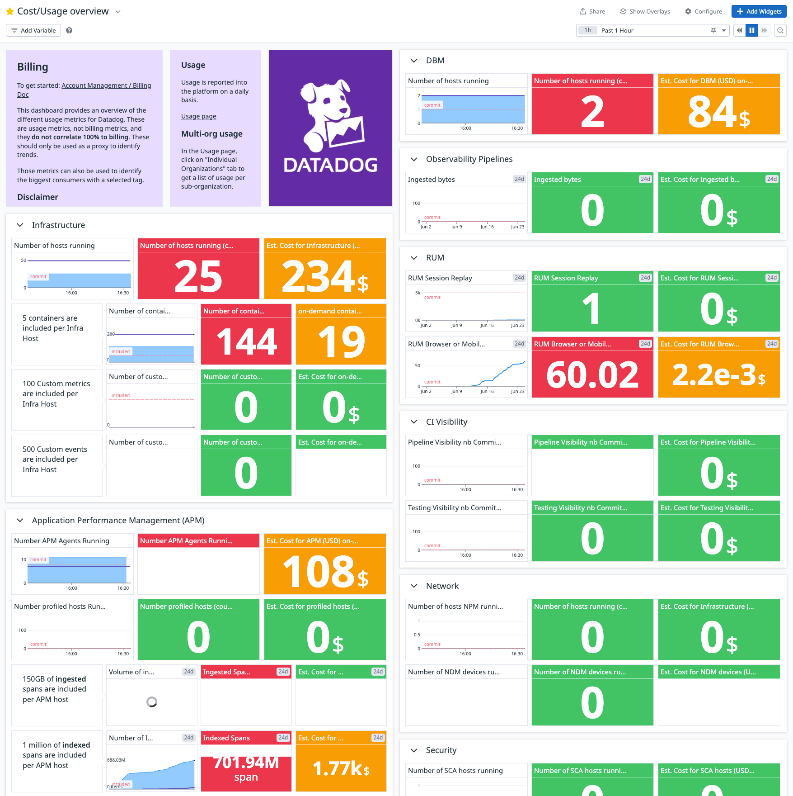
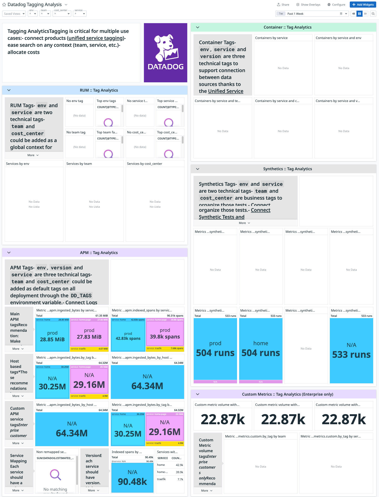

# Screenshots

## Cost & Usage Dashboard

## Tagging Analysis

# Terraform Module

<!-- BEGIN_TF_DOCS -->
## Requirements

No requirements.

## Providers

| Name | Version |
|------|---------|
|  [datadog](#provider\_datadog) | n/a |

## Modules

No modules.

## Resources

| Name | Type |
|------|------|
| [datadog_dashboard.cost_dashboard](https://registry.terraform.io/providers/DataDog/datadog/latest/docs/resources/dashboard) | resource |
| [datadog_dashboard.tagging_dashboard](https://registry.terraform.io/providers/DataDog/datadog/latest/docs/resources/dashboard) | resource |

## Inputs

| Name | Description | Type | Default | Required |
|------|-------------|------|---------|:--------:|
|  [apm\_type](#input\_apm\_type) | n/a | `string` | `"standard"` | no |
|  [commited\_additional\_indexed\_spans](#input\_commited\_additional\_indexed\_spans) | value in million spans | `number` | `0` | no |
|  [commited\_apm\_hosts](#input\_commited\_apm\_hosts) | n/a | `number` | `0` | no |
|  [commited\_asm\_sca\_hosts](#input\_commited\_asm\_sca\_hosts) | n/a | `number` | `0` | no |
|  [commited\_ci\_visibility\_pipeline\_committers](#input\_commited\_ci\_visibility\_pipeline\_committers) | n/a | `number` | `0` | no |
|  [commited\_ci\_visibility\_test\_committers](#input\_commited\_ci\_visibility\_test\_committers) | n/a | `number` | `0` | no |
|  [commited\_container\_apps](#input\_commited\_container\_apps) | n/a | `number` | `0` | no |
|  [commited\_dbm\_hosts](#input\_commited\_dbm\_hosts) | n/a | `number` | `0` | no |
|  [commited\_hosts](#input\_commited\_hosts) | n/a | `number` | `0` | no |
|  [commited\_indexed\_logs](#input\_commited\_indexed\_logs) | value in million events | `number` | `0` | no |
|  [commited\_ingested\_logs](#input\_commited\_ingested\_logs) | value in Gb | `number` | `0` | no |
|  [commited\_network\_devices](#input\_commited\_network\_devices) | n/a | `number` | `0` | no |
|  [commited\_network\_hosts](#input\_commited\_network\_hosts) | n/a | `number` | `0` | no |
|  [commited\_op\_ingested\_logs](#input\_commited\_op\_ingested\_logs) | value in Gb | `number` | `0` | no |
|  [commited\_profiling\_hosts](#input\_commited\_profiling\_hosts) | leave to 0 if subscribed through apm enterprise | `number` | `0` | no |
|  [commited\_rum\_replay](#input\_commited\_rum\_replay) | number of 1K sessions | `number` | `0` | no |
|  [commited\_rum\_sessions](#input\_commited\_rum\_sessions) | number of 1K sessions | `number` | `0` | no |
|  [commited\_sds\_logs](#input\_commited\_sds\_logs) | value in Gb | `number` | `0` | no |
|  [commited\_serverless\_asm\_invocations](#input\_commited\_serverless\_asm\_invocations) | n/a | `number` | `0` | no |
|  [commited\_serverless\_workload\_lambda\_invocations](#input\_commited\_serverless\_workload\_lambda\_invocations) | n/a | `number` | `0` | no |
|  [commited\_serverless\_workload\_monitoring\_lambda](#input\_commited\_serverless\_workload\_monitoring\_lambda) | n/a | `number` | `0` | no |
|  [commited\_siem\_logs](#input\_commited\_siem\_logs) | n/a | `number` | `0` | no |
|  [commited\_synthetics\_api](#input\_commited\_synthetics\_api) | number of 10K test runs | `number` | `0` | no |
|  [commited\_synthetics\_browser](#input\_commited\_synthetics\_browser) | number of 1K test runs | `number` | `0` | no |
|  [commited\_synthetics\_mobile](#input\_commited\_synthetics\_mobile) | number of 100 test runs | `number` | `0` | no |
|  [host\_type](#input\_host\_type) | n/a | `string` | `"pro"` | no |
|  [monitors\_tags](#input\_monitors\_tags) | n/a | `set(string)` | <pre>[   "service:datadog_usage",   "terraform:true",   "team:datadog_support",   "env:usage" ]</pre> | no |

## Outputs

No outputs.
<!-- END_TF_DOCS --> 